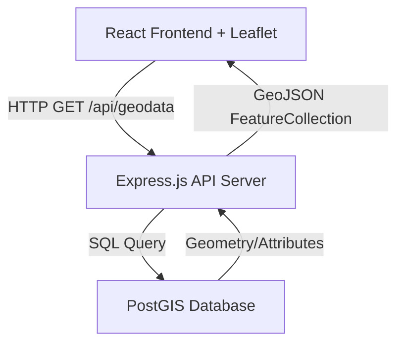

# POLARIS WebGIS
> **Pemetaan Operasional Longsor & Akses Rawan Isolasi Sumatera**

POLARIS adalah aplikasi WebGIS interaktif berbasis 3-tier architecture yang dirancang khusus untuk memetakan, memantau, dan mensimulasikan dampak bencana longsor terhadap aksesibilitas jalan dan fasilitas kesehatan di wilayah Sumatera (fokus data simulasi pada Provinsi Lampung).

---

## 🏗️ Arsitektur Sistem

Aplikasi ini berjalan dalam lingkungan terisolasi menggunakan Docker Compose dengan pembagian peran sebagai berikut:



1. **Frontend (React.js + Leaflet.js):** Dashboard interaktif 3 kolom bertema gelap (*Executive Command Center*) untuk memfilter wilayah, mensimulasikan bencana longsor, dan menyajikan statistik dampak spasial secara *real-time*.
2. **Backend (Node.js + Express.js):** REST API server yang aman dengan pembatasan CORS, optimasi header via Helmet, dan konversi data geospasial PostGIS menjadi format GeoJSON standard.
3. **Database (PostgreSQL + PostGIS):** Basis data spasial yang menyimpan data geometri ruas jalan (`LineString`), zona bahaya (`Polygon`), dan rumah sakit/faskes (`Point`) beserta fungsinya.

---

## 🛠️ Prasyarat

Pastikan perangkat Anda sudah terpasang:
* [Docker](https://docs.docker.com/get-docker/)
* [Docker Compose](https://docs.docker.com/compose/install/)

---

## 🚀 Cara Menjalankan Aplikasi

Ikuti langkah-langkah berikut untuk menjalankan seluruh stack POLARIS WebGIS:

1. **Clone/masuk ke direktori proyek:**
   ```bash
   cd polaris-webgis
   ```

2. **Jalankan layanan menggunakan Docker Compose:**
   ```bash
   docker compose up --build
   ```
   *Perintah ini akan mengunduh image, melakukan build pada frontend & backend, menginisialisasi database spasial, dan menjalankan seluruh container.*

3. **Verifikasi container yang berjalan:**
   ```bash
   docker compose ps
   ```
   Layanan harus menunjukkan status `Up` (dengan `postgis-db` bertuliskan `healthy`):
   * `polaris-frontend` -> Port `3000`
   * `polaris-api` -> Port `5000`
   * `polaris-postgis` -> Port `5432`

---

## 🌐 Akses Dashboard & API

Setelah semua layanan berjalan, Anda dapat mengakses:

* **Dashboard WebGIS (Frontend):** [http://localhost:3000](http://localhost:3000)
* **API Health Check:** [http://localhost:5000/api/health](http://localhost:5000/api/health)
* **Geospatial GeoJSON Data:** [http://localhost:5000/api/geodata](http://localhost:5000/api/geodata)

> [!NOTE]
> Karena kebijakan keamanan CORS yang ketat pada backend server, penjelajahan langsung API menggunakan `curl` atau browser dari host luar memerlukan header asal yang valid (contoh: `Origin: http://localhost:3000`).

---

## 📊 Skema Database Spasial (PostGIS)

Database otomatis diinisialisasi menggunakan berkas [init.sql](database/init.sql) saat pertama kali dijalankan. Struktur tabel spasial:

### 1. `ruas_jalan` (LineString, SRID 4326)
Menyimpan data jalan arteri nasional, provinsi, dan kabupaten di Lampung.
* Kolom: `id`, `nama_ruas`, `panjang_km`, `status_jalan`, `kelas_jalan`, `populasi_terdampak`, `geom`

### 2. `zona_longsor` (Polygon, SRID 4326)
Menyimpan area polygon dengan tingkat kerawanan longsor tinggi/kritis.
* Kolom: `id`, `nama_zona`, `tingkat_bahaya`, `luas_ha`, `deskripsi`, `estimasi_populasi`, `geom`

### 3. `fasilitas_kesehatan` (Point, SRID 4326)
Menyimpan lokasi titik fasilitas kesehatan rujukan bencana.
* Kolom: `id`, `nama_faskes`, `tipe`, `kapasitas_bed`, `status_operasional`, `alamat`, `geom`

---

## ⚡ Fitur Utama & Panduan Penggunaan

1. **Visualisasi Peta Interaktif:**
   * Peta berbasis OpenStreetMap memuat data spasial langsung dari PostGIS.
   * Setiap layer memiliki warna unik (Jalan = Hijau, Zona Longsor = Orange/Merah, Faskes = Marker Rumah Sakit).
   * Klik pada elemen peta untuk membuka popup informasi atribut detail.

2. **Filter Wilayah:**
   * Gunakan dropdown di kolom kiri untuk memfilter visualisasi berdasarkan wilayah administratif Lampung (Tanggamus, Lampung Barat, Pesisir Barat, dll.).

3. **Simulasi Dampak Longsor:**
   * Tekan tombol **"SIMULASI LONGSOR"** di panel kontrol kiri.
   * Peta akan berubah secara dinamis:
     * Jalan di zona bahaya berubah menjadi merah putus-putus (terdampak/putus).
     * Fasilitas kesehatan dengan aksesibilitas terganggu (kapasitas bed < 200) akan berkedip merah dengan status **"TERISOLASI"**.
   * Panel statistik kanan akan memperbarui data secara *real-time*:
     * Menghitung total populasi terisolasi.
     * Menyajikan daftar faskes yang terisolasi dan kapasitas bed rujukan yang hilang.
     * Menyajikan rincian panjang ruas jalan yang putus.

---

## 🔒 Praktik Keamanan Terpasang

* **CORS Whitelist:** Mengunci akses API hanya untuk domain frontend yang sah.
* **Helmet Security Headers:** Proteksi terhadap serangan Clickjacking, MIME sniffing, dan XSS.
* **SQL Injection Prevention:** Semua pemanggilan query database menggunakan *Parameterized Queries*.
* **Minimalist Container Footprint:** Image frontend dan backend didesain seminimal mungkin untuk mempercepat waktu muat dan mengurangi celah eksploitasi.
